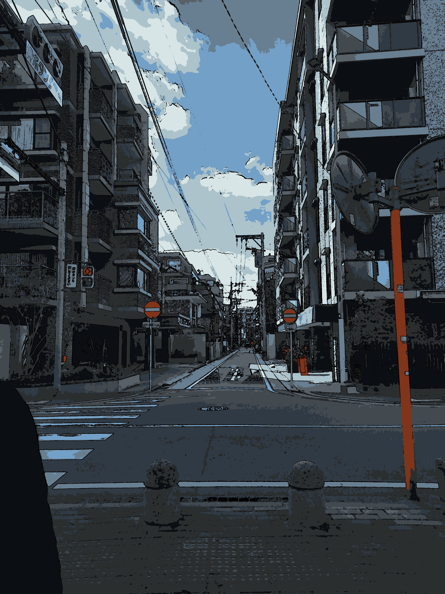
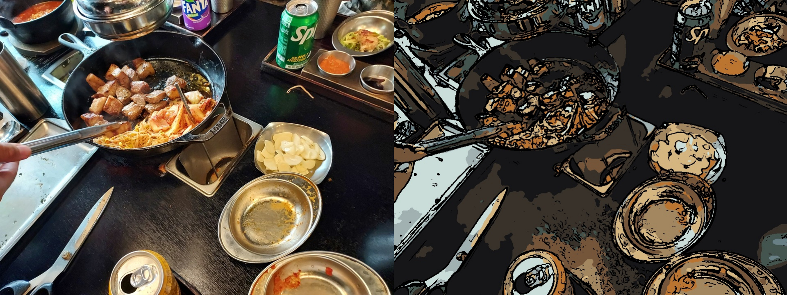
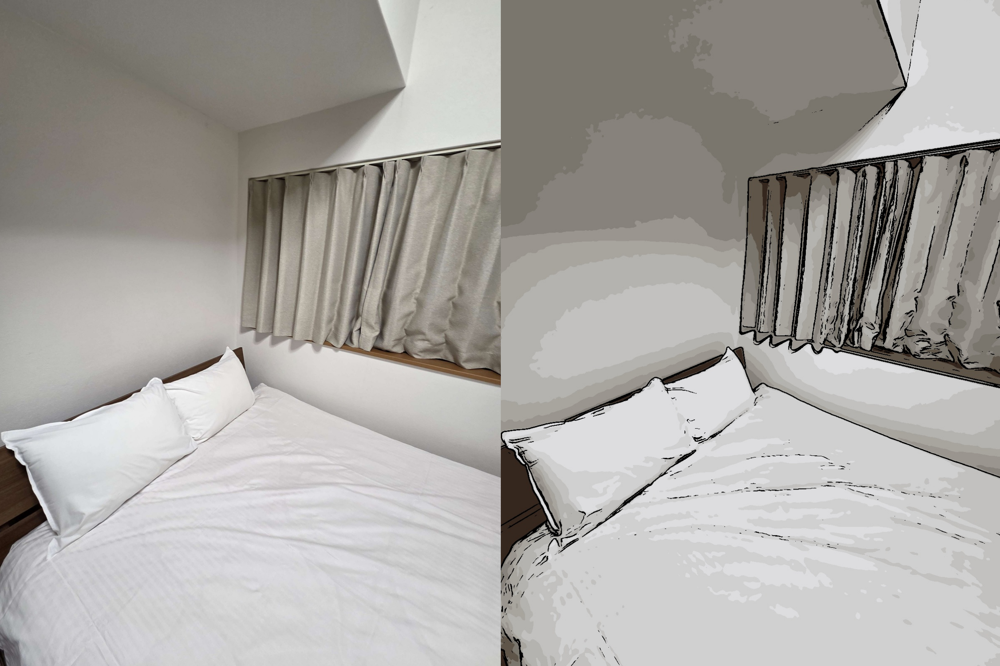

# Cartoon Rendering

## 개요

입력으로 넣은 이미지를 만화(cartoon) 스타일로 변환하여 출력 및 저장하는 프로그램이다.
OpenCV를 활용하여 윤곽선(edge)을 추출하고, 색상을 단순화하여 만화 느낌을 표현하였다.

---

## 동작 과정 설명

### F. input image 입력 및 확인

### 1. Grayscale 변환 및  noise   제거

* 입력 이미지를 grayscale로 변환
* median filter를 이용하여 noise 제거

### 2.  edge   검출 (Sobel)

* Sobel 필터를 이용하여 x, y 방향의 변화량을 계산
* gradient magnitude를 구하여  edge   강도를 계산
* threshold를 적용하여 noise를 제거하고 명확한 edge만 추출

### 3. color smooth filter &  simplification  

* bilateral filter를 사용하여 색상을 부드럽게 만듦
* 경계는 유지하면서  noise  를 제거

- k-means clustering을 이용하여 색상 개수를 줄임
- 이미지의 색을 몇 개의 대표 색으로 표현하여 만화 느낌을 강화

### 4. 최종 합성

* 엣지 정보를 이용하여 색상 이미지와 결합
* 윤곽선과 단순화된 색상이 결합된 만화 스타일 이미지 생성

### L. result image 출력 및 비교, 저장

---

## 결과

### 잘 되는 경우

* 윤곽선이 뚜렷하고 객체 간 색 대비가 비교적 큰 이미지(test_2)
* 사진처럼 픽셀 수가 애초에 굉장히 큰 이미지(sample)

### 잘 안 되는 경우

* 색 대비가 낮거나 배경과 객체의 구분이 어려운 이미지(edge 탐지가 잘 안됨)(test_5)
* 객체가 집중적으로 많거나 크기가 작은 이미지(전반적으로 색이 뭉개져서 원본 유추가 불가)(test_0)

---

## 한계점

* 색 대비가 너무 낮은 영역에서는 edge를 잘 찾지 못함(test_5)
* 최대한 edge 검출하기 위해 감도를 올려둬서 물체에 생긴 자잘한 빛의 반사와 그림자까지 탐지하는 경향이 있음(test_3)
* 필터와 k-means에 의해 색을 뭉개서 물체가 원본을 추측하지 못할 정도로 부자연스럽게 표현될 수 있음(test_1)

---

## 출력 결과 예시

### good case

입력 이미지 픽셀 차이 비교(좌:2000x1500 / 우:4000x3000)

### bad case
물체와 색이 완전히 뭉개져서 무슨 물체인지 구분 불가

대비가 너무 낮은 부분 인식 불가
